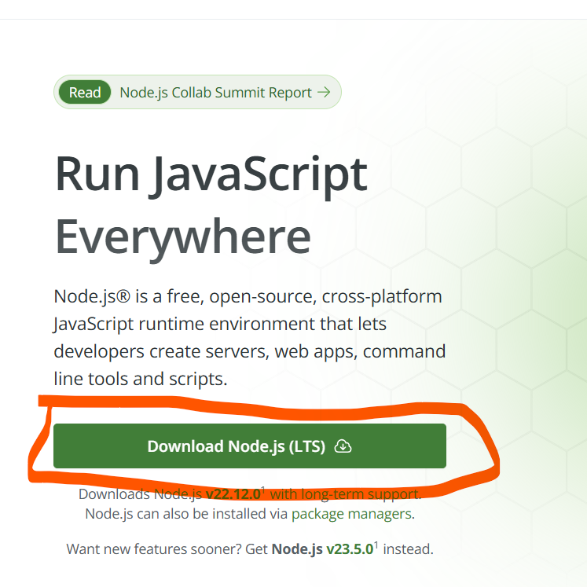
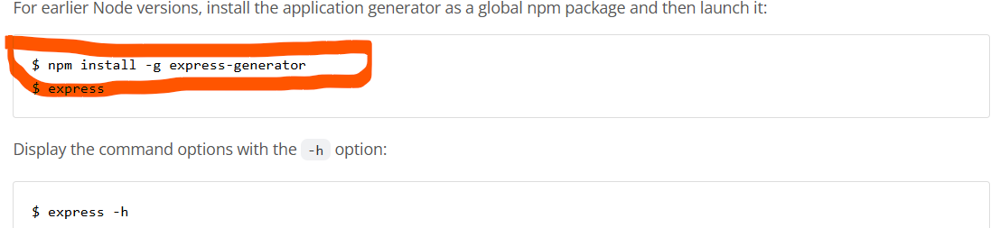
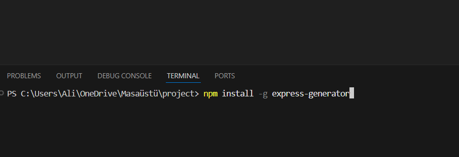

# Now I will show you how to enable expressjs.
## first https://nodejs.org/en go to this site and download node js

## after download
## to this sitehttps://expressjs.com/en/starter/generator.html You go and copy where I show you.

## Then you enter vscode and open the terminal.

## you copy and paste this into the terminal
